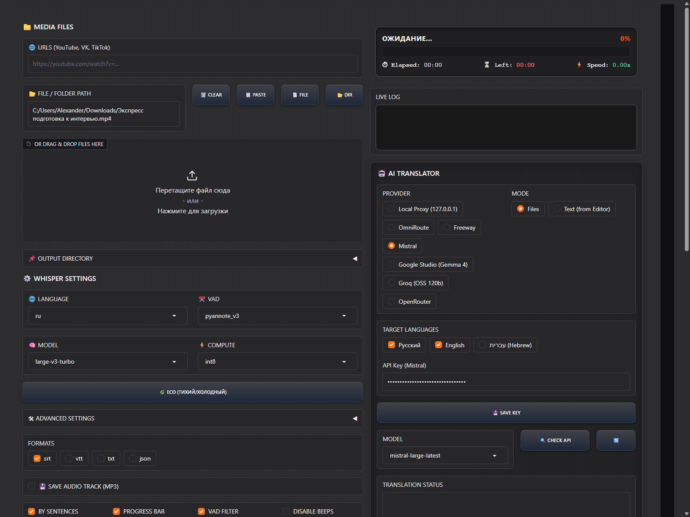

# KATAV

[](https://github.com/Flexible78/KATAV/actions/workflows/ci.yml)

**Sound becomes text.**

*Alexander Tsyrkin (Flexible78)*

KATAV is a local-first Windows toolkit for speech recognition. Audio and video transcription runs entirely offline through Faster-Whisper-XXL, with no cloud calls for the core speech-to-text pipeline. An optional AI translation module lets you convert transcripts and subtitles into other languages through pluggable providers, and an experimental vocabulary extractor turns transcripts into structured dictionaries.



## Modules

| Module | Function | Status |
| --- | --- | --- |
| Katav | Speech-to-text via Faster-Whisper (local, GPU/CPU) | Stable |
| Safa | Transcript and subtitle translation (RU / EN / HE and more) | Stable |
| Mila | Vocabulary extraction from transcripts | Experimental |

## Features

- **Offline transcription** — speech-to-text runs locally through Faster-Whisper-XXL on GPU or CPU, with no network connection required.
- **Multiple output formats** — export transcripts as TXT, SRT, VTT, or JSON.
- **Optional AI translation** — translate transcripts and subtitles through pluggable providers (Local Proxy, OmniRoute, Freeway, OpenRouter, Google Gemini / Studio, Groq, Mistral).
- **Per-provider model memory** — the last working model for each provider is remembered automatically.
- **Dynamic model lists** — fetch the list of available models directly from each provider with the refresh button.
- **Batch processing** — transcribe multiple files in one run, with an optional cooldown pause between files to manage GPU temperature.
- **Google Drive support** — download private Google Drive files after OAuth sign-in; public shared links work without authentication.
- **Browser UI** — a Gradio-based web interface runs locally on your machine.

## UI options

| Control | What it does |
| --- | --- |
| BY SENTENCES | Split Whisper output by sentences instead of by arbitrary chunk size. |
| PLAIN TEXT | Also write a `*_CLEAN.txt` file with block numbers and timestamps removed. |
| PROGRESS BAR | Show a live progress bar in the log while Whisper runs. |
| VAD | Enable voice-activity detection to skip silent sections. |
| NO BEEPS | Suppress the completion beep after each file. |
| SAVE MP3 | Extract the audio track as an MP3 file alongside the transcript. |
| TRANSLATE ANYWAY | Force translation into every checked target language, ignoring auto-detected source language. |
| + PLAYLIST | Add a YouTube playlist URL and expand it into individual videos. |
| JOIN | Merge all translated text files into one document per language. |
| ZIP | Pack produced files into a downloadable ZIP archive. |
| TOGGLE THEME | Switch between light and dark theme. |
| EXIT | Stop the app and attempt to close the browser tab. |

## Supported sources

- **Local files**: any common audio/video format (`mp3`, `wav`, `mp4`, `mkv`, etc.).
- **YouTube**: single videos, playlists, and Shorts.
- **Google Drive**: public shared links and private files after OAuth sign-in.
- **Spotify**: **not supported**. Spotify audio is DRM-protected and cannot be downloaded. For podcasts, use the RSS feed or the same episode on YouTube.

## Requirements

- **Windows 10/11 64-bit**
- **Python 3.10+**
- **NVIDIA GPU recommended** (CPU-only mode is supported but slower)
- **[Faster-Whisper-XXL](https://github.com/Purfview/whisper-faster-XXL)** downloaded separately — KATAV shells out to `faster-whisper-xxl.exe`

## Quick start

```bash
git clone https://github.com/Flexible78/KATAV.git
cd KATAV
python -m venv .venv
.venv\Scripts\activate
pip install -r requirements.txt
python main.py
```

Then open the local URL shown in the terminal. Transcription works fully offline with no API keys. API keys are only required for the translation module.

For full setup instructions including how to point KATAV at `faster-whisper-xxl.exe` and how to configure translation providers, see **[docs/SETUP.md](docs/SETUP.md)**.

For a step-by-step guide on transcribing, translating, and extracting vocabulary, see **[docs/USAGE.md](docs/USAGE.md)**.

## Security

This repository contains **no API keys, no personal paths, no media files, and no transcripts**. All credentials are read from a local, gitignored `whisper_api_keys.json` file that you create on your own machine from the provided `whisper_api_keys.example.json` template. The local Whisper executable path is resolved from an environment variable, a local `whisper_settings.json` file, or autodiscovery — never hardcoded.

## Google Drive OAuth

To transcribe private Google Drive files, sign in through the app:

1. Create a Desktop OAuth client in [Google Cloud Console](https://console.cloud.google.com/), enable the Drive API, and download the JSON secret.
2. Rename the downloaded file to `google_client_secret.json` and place it next to `main.py`.
3. Click **SIGN IN TO GOOGLE** in the app and grant read-only access.

See [docs/SETUP.md](docs/SETUP.md) for the full walkthrough.

## Troubleshooting

### `faster-whisper-xxl.exe` was not found

Transcription needs the Faster-Whisper-XXL executable. Point KATAV at it using **one of three methods** (full details in [docs/SETUP.md](docs/SETUP.md)):

1. Set the `WHISPER_EXE` environment variable to the full path of the executable.
2. Add `"whisper_exe"` to `whisper_settings.json`.
3. Place the extracted `Faster-Whisper-XXL` folder next to the app folder (autodiscovery).

### Port already in use

Launching a second instance can fail with `Cannot find empty port in range: 7861-7861` when the default port is busy. Close the other instance, or pick a different port before launching:

```cmd
set GRADIO_SERVER_PORT=7899
python main.py
```

If no port is specified and the default is busy, KATAV automatically falls back to a free port.

## Tested on

Windows 11, Python 3.14, clean virtual environment, fresh clone.

## Related project

**LECTA** is the companion text-to-speech tool. *KATAV writes, LECTA reads.*

## License

All rights reserved. See [LICENSE](LICENSE).
